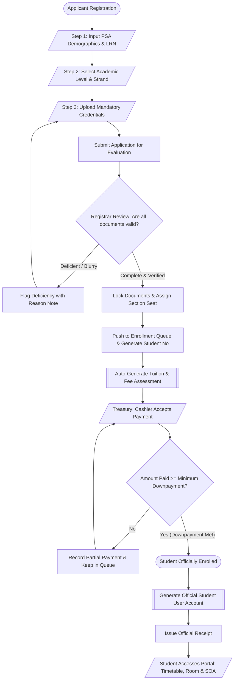
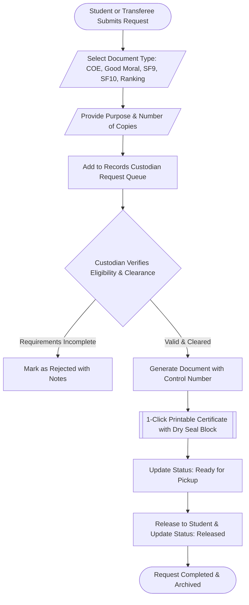
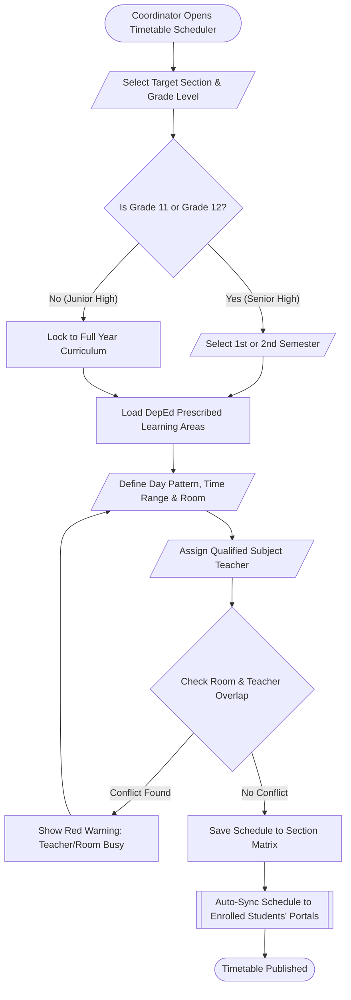

# SIA High School — Admission, Enrollment & School Management System

> **Comprehensive School Information & Accounting System**  
> Tailored for Philippine Secondary Education: Junior High School (Grades 7–10) and Senior High School (Grades 11–12) with full DepEd compliance (SF1, SF5, SF9, SF10/Form 137), Automated Scheduling, Treasury Assessment, and Document Request System (DRS).

---

## 📑 Table of Contents
1. [System Overview](#-system-overview)
2. [Technology Stack](#-technology-stack)
3. [User Roles & Access Permissions](#-user-roles--access-permissions)
4. [System Workflow Flowcharts](#-system-workflow-flowcharts)
   - [A. End-to-End Admission & Enrollment Workflow](#a-end-to-end-admission--enrollment-workflow)
   - [B. Document Request System (DRS) Workflow](#b-document-request-system-drs-workflow)
   - [C. Master Section Scheduling Workflow](#c-master-section-scheduling-workflow)
5. [Key Feature Modules](#-key-feature-modules)
6. [Multi-PC Portability & Installation Guide](#-multi-pc-portability--installation-guide)
7. [Default Demo Credentials](#-default-demo-credentials)

---

## 🌟 System Overview

SIA High School Enrollment System is an all-in-one institutional portal designed to operate offline on local servers (e.g. XAMPP) or online web servers. It eliminates manual paper queues and spreadsheets by integrating every stage of the student academic lifecycle:
* **Online Admission Wizard**: Multi-step PSA demographic capture, LRN validation, SHS track/strand selection, and document upload.
* **Registrar Evaluation**: Requirement verification, deficiency flagging, and section seating queue.
* **DepEd Curriculum & Master Scheduler**: Conflict-free day-by-day weekly timetable for 40 class sections, 119 curriculum subjects, and teacher workloads.
* **Treasury & Accounting**: Automated tuition computation with DepEd Voucher discounts, cashier payment collection, and bounded balance validation.
* **DepEd Records & Archives**: Multi-year Permanent Transcript (SF10 / Form 137), Report Card (SF9 / Form 138) with Observed Core Values, DepEd School Forms (SF1, SF5), Honors/GWA Ranking, and DRS Certificate Issuance.
* **Student Portal**: Live class schedule, homeroom assignment, statement of account, payment receipts, and school event calendar.

---

## 💻 Technology Stack

* **Backend**: PHP 8.x (Custom MVC Architecture, RESTful JSON APIs, PDO Database Layer, Secure Session Token Auth).
* **Frontend**: Vue 3 (Composition API, Single Page Application), Vite, Vanilla CSS & Tailwind Utility Design System, Lucide Icons.
* **Database**: MySQL / MariaDB (InnoDB engine, relational foreign keys, stored UTF-8 dumps).
* **Environment**: Localhost XAMPP (`http://localhost/sia-project`) with 100% offline self-contained dependencies.

---

## 👥 User Roles & Access Permissions

| Role | Target Portal | Primary Capabilities & Responsibilities |
| :--- | :--- | :--- |
| **Applicant** | `/admission` | Submits PSA credentials, LRN, SHS Strand, and requirements; tracks application progress. |
| **Registrar** | `/registrar/dashboard` | Evaluates submitted documents, flags deficiencies, assigns section seats, approves queue. |
| **Coordinator** | `/coordinator/dashboard` | Manages 40 class sections, 119 DepEd subjects, tracks/strands, and builds conflict-free timetables. |
| **Treasury** | `/treasury/dashboard` | Assesses tuition and fees, processes cashier payments bounded to balance, and issues Official Receipts. |
| **Records Custodian** | `/records/dashboard` | Generates DepEd SF1, SF5, SF9 (Core Values), SF10 (Form 137), issues certificates via DRS, and computes Honors. |
| **Student** | `/student/dashboard` | Views assigned section & room, enrolled subject timetable with teachers, SOA balance, and event calendar. |
| **Super Admin** | `/admin/dashboard` | Oversees institutional statistics, user accounts, audit trails, and school year locking controls. |

---

## 🔄 System Workflow Flowcharts

### A. End-to-End Admission & Enrollment Workflow



---

### B. Document Request System (DRS) Workflow



---

### C. Master Section Scheduling Workflow



---

## 🚀 Key Feature Modules

### 1. Admission & Student Classification
* **JHS vs. SHS Curriculum Filtering**: Automatic strand-to-track association (STEM, ABM, HUMSS, TVL-ICT, TVL-HE, TVL-IA, TVL-AFA, GAS).
* **Transferee Document Compliance**: Specialized tracking for Form 137 submission from previous schools.
* **ESC & DepEd Voucher Integration**: Automatically calculates and deducts tuition vouchers (100% Public Completer, 80% ESC Grantee, 50% Private Non-ESC).

### 2. Class Section Scheduler & Matrix
* **40 Pre-Loaded Sections**: 24 Junior High sections (Rizal, Bonifacio, Mabini, Luna, Del Pilar, Silang, Aguinaldo, Jacinto) and 16 Senior High sections (Newton, Einstein, Curie, Pascal, Turing, Lovelace, Jobs, Gates, Smith, Keynes, etc.).
* **Searchable Combobox Selector**: Real-time filtering across section names, grade categories, strand codes, and room numbers.

### 3. Treasury & Cashier Billing
* **Remaining Balance Bounding**: Cashier inputs are clamped and validated in real-time so payment cannot exceed the student's remaining balance.
* **1-Click Full Balance Settlement**: Quick button to populate exact outstanding dues.
* **Official Receipt Generator**: Generates formatted printable receipts with breakdown of base tuition, laboratory, miscellaneous, vouchers, and previous payments.

### 4. DepEd Archives & Records Portal
* **DepEd SF10 (Form 137)**: Multi-year permanent transcript of scholastic records with eligibility transfer certificates.
* **DepEd SF9 (Form 138)**: Quarterly academic report card featuring DepEd Observed Core Values (*Maka-Diyos, Makatao, Makakalikasan, Makabansa*).
* **School Form 1 (SF1)**: School Register masterlist with learner demographics, parental info, and address.
* **School Form 5 (SF5)**: Report on Promotion, Level of Proficiency, and Learning Progress.
* **Academic Honors Engine**: Automatic DepEd honors computation (*With Highest Honors* $\ge 98$, *With High Honors* $\ge 95$, *With Honors* $\ge 90$).

---

## 📦 Multi-PC Portability & Installation Guide

The system is configured for offline portability. To transfer or deploy to another computer:

### Step 1: Place Files in XAMPP
Copy the entire `sia-project` folder into:
```
C:\xampp\htdocs\sia-project
```

### Step 2: Import MySQL Database
1. Open **XAMPP Control Panel** and start **Apache** and **MySQL**.
2. Open your browser and navigate to `http://localhost/phpmyadmin`.
3. Create a new database named **`enrollment_system`** with `utf8mb4_unicode_ci` collation.
4. Click **Import** and select the file:
   ```
   c:\xampp\htdocs\sia-project\backend\database\enrollment_system.sql
   ```
5. Click **Go** / **Import**. (All 40 sections, 119 subjects, 520 section schedules, student records, and events will be restored).

### Step 3: Run the Application
* **Production Build (Standard)**:
  Open your web browser and navigate to:
  ```
  http://localhost/sia-project
  ```
* **Development Mode (Optional)**:
  ```bash
  cd c:\xampp\htdocs\sia-project\frontend
  npm install
  npm run dev
  ```

---

## 🔑 Default Demo Credentials

| Role | Username | Password | Default Portal Access |
| :--- | :--- | :--- | :--- |
| **Super Administrator** | `admin` | `password123` | Institutional Admin Dashboard |
| **Academic Coordinator** | `maria_coordinator` | `password123` | Master Scheduling & Curriculum |
| **Registrar** | `maria_registrar` | `password123` | Admission Evaluation & Queue |
| **Treasury / Cashier** | `maria_treasury` | `password123` | Cashier Payment & OR Issuance |
| **School Records Custodian** | `maria_records` | `password123` | DepEd SF1, SF5, SF9, SF10 & DRS |
| **Enrolled Student (JHS)** | `2026-JHS-0001` | `RONALDO` | Student Timetable & SOA |
| **Enrolled Student (SHS)** | `2026-SHS-0005` | `ALVARES` | Student Timetable & SOA |
| **Demo Student** | `student2026` | `password123` | General Student Portal |

---

*Developed for SIA High School Information, Admission, and Accounting Management.*
# sia-project6969

